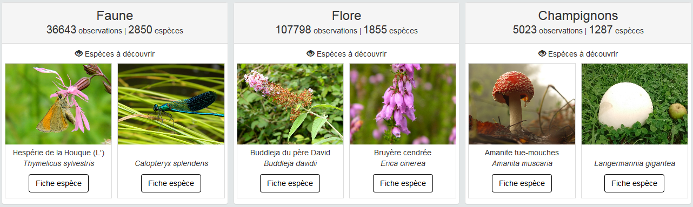
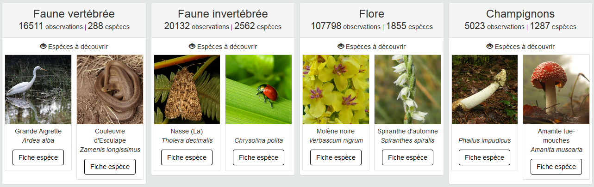

# Quelques adaptations de l'Atlas du Parc Normandie-Maine


## Ajout des Villes portes à la carte

Le territoire du Parc est complété par les 14 villes-portes adhérentes à la Charte.

.. image :: docs/images/geonature-atlas-schema-02.jpg

[](https://raw.githubusercontent.com/sig-pnrnm/GeoNature-PNRNM/master/atlas_pnrnm/map_atlas_pnrnm.png)

Postérieurement à l'installation initiale (décembre 2016) le JSON du territoire (`/home/geonatureadmin/atlas/static/custom/territoire.json`) est modifié en ajoutant les villes portes.
(il aurait été préférable de gérer initialement le territoire à l'installation de GeoNature-Atlas)


### Création du JSON
La modification a été faite sous QGis, puis export en GeoJson.

(ToDo : simplifier les géométries - en gardant la topologie ! - pour un chargement + rapide. JSON = 2.1 Mo).

### Mise en forme du JSON
Le JSON contient une propriete `nom` (valeurs : `Parc Normandie-Maine` et `Villes Portes`) sur laquelle on base un style dynamique en modifiant le fichier `/home/geonatureadmin/atlas/static/mapGenerator.js`
Le style est créé par cette fonction :

```javascript
style: function(feature) {
	   n = feature.properties.nom;
	   return n == 'Parc Normandie-Maine' ? {color: '#3388ff', opacity:1, fill: false, weight: 3} :
				  {color: '#3388ff', opacity:1, fill: false, weight: 2, dashArray: '3'};
	 }
```

(ToDo : adapter ce styles aux nouveaux paramètres `configuration.MAP.BORDERS_COLOR` et `configuration.MAP.BORDERS_WEIGHT`)

### Ajouter une légende

Modification du contenu de la variable `htmlLegend` dans les fichiers `static/mapMailles.js`, `static/mapCommune.js`, `static/mapPoint.js`, `static/mapSwitcher.js` et `static/mapHome.js` 

- Dans `mapHome.js` :

```javascript
htmlLegend =	"<p><i style='border: solid 1px red; width: 30px;'> &nbsp; &nbsp; &nbsp;</i> <span> Maille comportant au moins une observation </span></p>" +
				"<p><i style='border:3px solid #3388ff; width: 30px;'> &nbsp; &nbsp; &nbsp;</i> <span> Périmètre du Parc Normandie-Maine </span></p>" +
				"<p><i style='border:2px dashed #3388ff; width: 30px;'> &nbsp; &nbsp; &nbsp;</i> <span> Villes Portes </span></p>";
```

- Dans `mapCommune.js` :

```javascript
	htmlLegendMaille = "<p><i style='border: solid 1px red;'> &nbsp; &nbsp; &nbsp;</i> Maille comportant au moins une observation</p>" +
						"<p><i style='border-style: dotted;'> &nbsp; &nbsp; &nbsp;</i> Limite de la commune</p>"+
						"<p><i style='border:3px solid #3388ff; width: 30px;'> &nbsp; &nbsp; &nbsp;</i> <span> Périmètre du Parc Normandie-Maine </span></p>" +
						"<p><i style='border:2px dashed #3388ff; width: 30px;'> &nbsp; &nbsp; &nbsp;</i> <span> Villes Portes </span></p>";

						
						
	htmlLegendPoint = "<p><i style='border-style: dotted;'> &nbsp; &nbsp; &nbsp;</i> Limite de la commune</p>"+
						"<p><i style='border:3px solid #3388ff; width: 30px;'> &nbsp; &nbsp; &nbsp;</i> <span> Périmètre du Parc Normandie-Maine </span></p>" +
						"<p><i style='border:2px dashed #3388ff; width: 30px;'> &nbsp; &nbsp; &nbsp;</i> <span> Villes Portes </span></p>";
```

- dans tous les autres :

```javascript
htmlLegend =	"<p><i style='border:3px solid #3388ff; width: 30px;'> &nbsp; &nbsp; &nbsp;</i> <span> Périmètre du Parc Normandie-Maine </span></p>" +
				"<p><i style='border:2px dashed #3388ff; width: 30px;'> &nbsp; &nbsp; &nbsp;</i> <span> Villes Portes </span></p>";
```

### Mise à jour du territoire en Base de données

( A FAIRE ! )

## Masquer l'onglet "Synonymes"

Cet onglet est considéré comme trop scientifique pour le public visé (grand public / élus).

Pour le supprimer, les rubriques concernées du templace `/home/geonatureadmin/atlas/templates/ficheEspece.html` sont simplement passées en commentaires :

```html
<!-- [...] -->
					<!--  Menu Synonyme non affiché
                    <li><a data-toggle="tab" href="#synonymes">Synonymes</a></li>
					-->
<!-- [...] -->
						<!--  Menu Synonyme non affiché
                        <div id="synonymes" class="tab-pane fade">
                            
                                Aucun synonyme pour ce taxon
                            
                                 
                                    
                                    {{ syn.nom_complet_html | safe}}
                                    
                                    
                                    |
                                    
                                
                            
                        </div>
						-->
<!-- [...] -->
```

## Ajout d'éléments dans l'onglet "Répartition"

La phrase "aucune info" est supprimée quand la chorologie locale n'est pas renseignée.
On ajoute les liens vers les portails régionaux et la carte de l'INPN.

To Do : centrer le logo INPN sous "France métropolitaine"

```html
                        <div id="chorologie" class="tab-pane fade">                                
                                
                                
                                    {{taxonDescription.chorologie}}
                                
								<br>

								<table style="text-align: center; width:100%; ">
								  <tbody>
									<tr>
									  <td><h4 class="text-center">Normandie</h4></td>
									  <td><h4 class="text-center">Pays-de-la-Loire</h4></td>
									</tr>
									<tr>
									  <td>
										<a class="btn btn-lg px-3 btn-default" href="https://odin.normandie.fr/odin/#/taxonomy/view?taxonID={{taxon.taxonSearch.cd_ref}}" role="button" data-toggle="tooltip" data-original-title="Consultez la fiche espèce sur ODIN" data-placement="bottom">ODIN 
										</a>
									  </td>
									  <td>
										<a class="btn btn-lg px-3 btn-default" href="http://79.137.82.197/espece/{{taxon.taxonSearch.cd_ref}}" role="button" data-toggle="tooltip" data-original-title="Consultez la fiche espèce sur Biodiv'Pays-de-la-Loire" data-placement="bottom">Biodiv'PDL 
										</a>
									  </td>
									</tr>
								  </tbody>
								</table>
								
								<div class="panel-body">
								   
									<h4 class="text-center">France métropolitaine</h4>

										<div id="inpnLink">
										
											<a class="btn btn-lg px-3 btn-default" href="https://inpn.mnhn.fr/espece/cd_nom/{{taxon.taxonSearch.cd_ref}}" role="button" data-toggle="tooltip" data-original-title="Consultez la fiche espèce sur l'INPN" data-placement="bottom">
											</a>
										
										</div>
							   
										<object data="https://inpn.mnhn.fr/cartosvg/couchegeo/repartition/atlas/{{taxon.taxonSearch.cd_ref}}/fr_light_l93,fr_light_mer_l93,fr_lit_l93" type="image/svg+xml" width="90%" height="90%">
											<param name="src" value="/cartosvg/couchegeo/repartition/atlas/{{taxon.taxonSearch.cd_ref}}/fr_light_l93,fr_light_mer_l93,fr_lit_l93">
											<param name="type" value="image/svg+xml">
											<param name="pluginspage" value="http://www.adobe.com/svg/viewer/install/">
										</object>
										<p class="small text-justify" style="color:#b1b1b1;">Cartographie issue de l'<a href='https://inpn.mnhn.fr/espece/cd_nom/{{taxon.taxonSearch.cd_ref}}' target="_blank" style="color:#7785ce;">INPN</a> - Avertissement : les données visualisables reflètent l'état d'avancement des connaissances et/ou la disponibilité des données existantes au niveau national : elles ne peuvent en aucun cas être considérées comme exhaustives.</p>

								 </div>
                        </div>
```


## Modification du nombre d'observations affichées sur la page d'acceuil

Le choix a été porté à 30 jours.
Cela se configure dans le fichier `/home/geonatureadmin/atlas/main/configuration/config.py`, au niveau de ces lignes :
```shell
# Carte de la page d'accueil: observations des 'x' derniers jours. Bien mettre en anglais et non accordé
NB_DAY_LAST_OBS = '30 day'
# Texte à afficher pour décrire la cartographie des 'dernières observations'
TEXT_LAST_OBS = u'Observations ces 30 derniers jours : '
```

Redémarrage du serveur pour prise en compte des modification (commande `reboot`)
(NB : vérifier s'il n'y aurait pas plus rapide / moins brutal ?)


## Statistiques par rangs taxonomiques

Plutôt que `Faune invertébrée, Faune vertébrée et Flore`, il est demandé d'afficher les statistiques pour `Faune, Flore et Champignons`
Comme nous pensions que le bloc était limité à 3 rangs, il est proposé aussi une version à 4 rangs taxonomiques : `Faune vertébrée, Faune invertébrée, Flore et Champignons`

### Vérification des données présentes en base

Requête SQL dans la base GeoNatureAtlas :
```sql
SELECT	regne, string_agg(distinct phylum, ',') as phylums,
	count(distinct o.cd_ref) as nb_sps_atlas
FROM	taxonomie.taxref t
JOIN	atlas.vm_observations o ON t.cd_ref = o.cd_ref
GROUP BY regne
ORDER BY regne;
```

Résultat :
```csv
"regne";"phylums";"nb_sps_atlas"
"Animalia";"Annelida,Arthropoda,Chordata,Mollusca,Nematoda";2902
"Bacteria";"Cyanobacteria";1
"Chromista";"Ochrophyta";2
"Fungi";"Ascomycota,Basidiomycota";1287
"Plantae";"Charophyta,Chlorophyta,Rhodophyta";1855
"Protozoa";"Myxomycota";4
```

Les 7 espèces de bactéries, chromistes et protozoaïres peuvent être exclues ou ajoutées à "Faune" (au Pôle Pat Nat de décider)

### Adaptation en conséquence du fichier de configuration

Cela se configure dans le fichier `/home/geonatureadmin/atlas/main/configuration/config.py`, au niveau de ces lignes :

- Explications :
```shell
## BLOC STAT PAR RANG : Parametre pour le bloc statistique 2 de la page d'accueil (statistiques par rang remontant 2 espèces aléatoirement ayant au moins une photo)
# Ce bloc peut être affiché ou non et peut être affiché sur 2, 3 ou 4 colonnes. Il est ainsi possible de mettre autant de blocs que souhaité (2, 3, 4, 6, 8...)
# Mettre dans RANG_STAT le couple 'rang taxonomique' - 'nom du taxon correspondant au rang' pour avoir des statistique sur ce rang -
# Fonctionne à tous les niveaux de rang présents dans la table taxref -

# exemple RANG_STAT = [{'ordre': ['Lepidoptera']}, {'classe': ['Insecta', 'Arachnida']}]
#         RANG_STAT_FR ['Papillon', 'Insecte et Araignées']
```

- version à 3 rangs : (`Faune, Flore et Champignons`)
```shell
AFFICHAGE_RANG_STAT = True
COLONNES_RANG_STAT = 3
RANG_STAT = [{'regne': ["Animalia"]}, {'regne': ["Plantae"]}, {'regne': ["Fungi"]}] 
RANG_STAT_FR = ['Faune', 'Flore', 'Champignons']
```




- version à 4 rangs : (`Faune vertébrée, Faune invertébrée, Flore et Champignons`)
```shell
AFFICHAGE_RANG_STAT = True
COLONNES_RANG_STAT = 4
RANG_STAT = [{'phylum': ["Chordata"]}, {'phylum': ["Arthropoda", "Mollusca", "Annelida", "Nematoda"]}, {'regne': ["Plantae"]}, {'regne': ["Fungi"]}]
RANG_STAT_FR = ['Faune vertébrée', 'Faune invertébrée', 'Flore', 'Champignons']
```




### Adaptation du moteur de recherche : afficher nom français en premier

Voici cette discussion sur Github : https://github.com/PnEcrins/GeoNature-atlas/issues/167

En attendant les évolution plus poussées liées à GeoNature V2, une adaptation de la vue SQL gérérant le moteur de recherche est faite :

Après avoir executé `DROP MATERIALIZED VIEW atlas.vm_search_taxon;`, relancer la création de la vue avec ce code adapté :

```sql
-- Materialized View: atlas.vm_search_taxon

-- DROP MATERIALIZED VIEW atlas.vm_search_taxon;

CREATE MATERIALIZED VIEW atlas.vm_search_taxon AS 
 SELECT tx.cd_nom,
    tx.cd_ref,
	COALESCE((tx.nom_vern::text || ' ('::text) || tx.lb_nom::text || ')'::text, tx.lb_nom::text) AS nom_search
--	COALESCE((tx.nom_vern::text || ' (<i>'::text) || tx.lb_nom::text || '</i>)'::text, '<i>'::text || tx.lb_nom::text || '</i>'::text) AS nom_search -- version avec nom latin en italique, mais nécessite adapter les script JQuery
   FROM atlas.vm_taxref tx
     JOIN atlas.vm_taxons t ON t.cd_ref = tx.cd_ref
WITH DATA;

ALTER TABLE atlas.vm_search_taxon
  OWNER TO geonatuser;
GRANT ALL ON TABLE atlas.vm_search_taxon TO geonatuser;
GRANT SELECT ON TABLE atlas.vm_search_taxon TO geonatatlas;

-- Index: atlas.vm_search_taxon_cd_nom_idx

-- DROP INDEX atlas.vm_search_taxon_cd_nom_idx;

CREATE UNIQUE INDEX vm_search_taxon_cd_nom_idx
  ON atlas.vm_search_taxon
  USING btree
  (cd_nom);

-- Index: atlas.vm_search_taxon_cd_ref_idx

-- DROP INDEX atlas.vm_search_taxon_cd_ref_idx;

CREATE INDEX vm_search_taxon_cd_ref_idx
  ON atlas.vm_search_taxon
  USING btree
  (cd_ref);

-- Index: atlas.vm_search_taxon_nom_search_idx

-- DROP INDEX atlas.vm_search_taxon_nom_search_idx;

CREATE INDEX vm_search_taxon_nom_search_idx
  ON atlas.vm_search_taxon
  USING btree
  (nom_search COLLATE pg_catalog."default");
```
